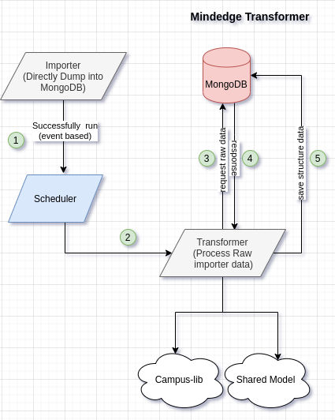

# Project Structure
The structure itself is self explanatory. but here's is short note of the contents.
```bash
├── app.py                              # Entry Point
├── client                              # Thirdparty clients functions
│   ├── __init__.py 
│   └── mongoengine_client.py           #
├── config                              # Config loaders
│   ├── config.py                       
│   └── __init__.py
├── docker-compose.yml                  # Docker compose file
├── Dockerfile                          # Docker file
├── Dockerfile.jenkins                  # Docker file used by Jenkins
├── docs                                # Application documentation
│   ├── architecture.md
│   ├── development.md
│   ├── dockerization.md
│   ├── environment_variables.md
│   ├── img
│   │   └── mindedge_transformer.png
│   └── production.md
├── mindedge                            # Mindedge
│   ├── course_mapper.py                # Course Mapper class
│   ├── __init__.py
│   ├── section_mapper.py               # Section Mapper class
│   └── transform.py                    # Mindedge Transformer class
├── README.md                           # Overview of the project
├── requirements.txt                    # Dependent library for python
├── services                            # Common services
│   ├── importer_service.py
│   ├── import_history_data_service.py
│   ├── __init__.py
│   └── transformer_service.py
├── helper.py                             # Common utility function
└── VERSION                             # Application version
```
